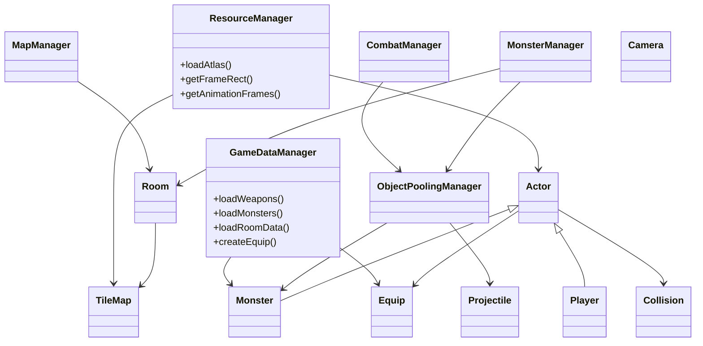
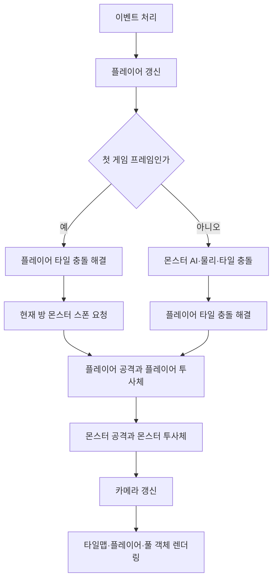
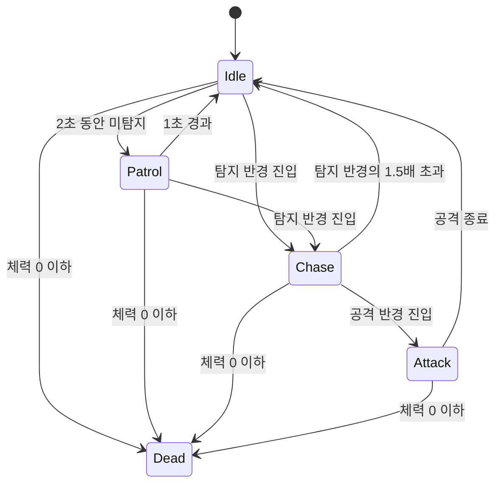

# Dungreed SFML 코드 인수인계서

## 1. 문서 목적과 기준

이 문서는 현재 작업 트리의 `Dungreed` 프로젝트를 다음 개발자가 안전하게 수정·확장할 수 있도록 작성했다. 코드와 JSON의 현재 상태를 기준으로 하며, 계획만 있고 아직 실행 흐름에 연결되지 않은 기능은 별도 표기한다.

## 2. 실행과 빌드

- 솔루션: `Dungreed.sln`
- 프로젝트: `Dungreed/Dungreed.vcxproj`
- 언어: C++17
- 라이브러리: SFML 3.1.0, nlohmann/json
- Debug 실행 파일: `x64/Debug/Dungreed.exe`

```powershell
& 'C:\Program Files\Microsoft Visual Studio\2022\Community\MSBuild\Current\Bin\amd64\MSBuild.exe' Dungreed.sln /t:Build /p:Configuration=Debug /p:Platform=x64 /m
```

소스와 새 문서는 UTF-8로 저장한다. 프로젝트 컴파일 옵션에 `/utf-8`이 포함되어 있다. 일부 기존 파일의 주석은 과거 인코딩 혼용으로 깨져 있으므로, 수정하는 파일의 주석은 반드시 UTF-8 한국어로 복구한다.

## 3. 현재 실행 범위

현재 게임은 테스트용 단일 Start 방을 생성하고, 플레이어가 첫 프레임을 표시한 뒤 해당 방의 몬스터 스폰을 요청한다.

- `main.cpp`가 Start 방, 문 4개, `SkelDog`와 `Bat` 스폰 정보를 직접 생성한다.
- `GameDataManager`는 `weapons.json`, `monsters.json`을 실제로 로드한다.
- `room_data.json` 로더는 구현되어 있으나, `main.cpp`와 `MapManager`의 실제 방 생성 흐름에는 아직 연결되지 않았다.
- `MapManager::buildAllRoomsDebug`는 하드코딩된 `RoomType` 레퍼런스 방의 미리보기 기능이다.

따라서 층 생성, 방 연결, 문 이동을 구현할 때는 하드코딩된 Start 방 흐름을 JSON 기반 흐름으로 교체해야 한다. 두 흐름을 동시에 활성화하면 같은 방 또는 몬스터가 중복 생성될 수 있다.

## 4. 전체 구조



### 책임 분리

| 구성 요소 | 책임 | 소유하지 않는 것 |
| --- | --- | --- |
| `ResourceManager` | 아틀라스 텍스처, 프레임, 피벗, 애니메이션 프레임 보관 | 게임 객체 |
| `GameDataManager` | 무기·몬스터·방 JSON을 런타임 데이터로 변환 | 방 인스턴스, 몬스터 객체 |
| `MapManager` | 현재 방과 디버그 미리보기 방 관리 | 몬스터 객체 |
| `MonsterManager` | 현재 방 몬스터의 스폰 요청, AI 갱신, 방 클리어 판정 | 몬스터 메모리 |
| `ObjectPoolingManager` | 몬스터·투사체 생성, 활성화, 반환, 재사용 | AI·전투 판정 |
| `CombatManager` | 근접·원거리 공격, 투사체 충돌, 피해 적용 | 객체 생명주기 |
| `Collision` | 액터-타일, 투사체-타일, 사각형 충돌 판정 | 이동 입력, AI |

## 5. 프레임 처리 순서

`main.cpp`의 실제 순서는 변경 시 반드시 유지한다.



중요 규칙:

- 액터 이동 후 `Collision::resolveMapCollision`을 호출한다.
- 플레이어가 같은 프레임에 처치 또는 적중시킨 몬스터는 그 프레임의 몬스터 공격에서 제외된다.
- 몬스터 스폰은 첫 화면 렌더링 이후에만 시작한다.
- 카메라는 충돌 보정이 끝난 플레이어 위치를 추적한다.

## 6. 핵심 객체와 변경 규칙

### 6.1 `Actor`, `Player`, `Controller`

`Actor`는 플레이어와 몬스터의 공통 기반이다.

- 스프라이트 원점은 하단 중앙이다. 스폰 좌표와 충돌 기준도 하단 중앙 기준으로 계산한다.
- `updatePhysics`는 이전 경계(`m_previousGlobalBounds`)를 먼저 저장한다. OneWay 플랫폼 충돌에 필요하므로 제거하면 안 된다.
- `takeDamage`는 체력 감소, 넉백, 피격 색상, 콘솔 로그를 처리한다.

`Controller` 입력 규칙:

| 입력 | 동작 |
| --- | --- |
| `A`, `Left` / `D`, `Right` | 좌우 이동 |
| `Space` | 점프 |
| `Left Shift` 또는 마우스 오른쪽 버튼 | 대시 시작 |
| 마우스 왼쪽 버튼을 뗄 때 | 공격 시작 |

`Player` 대시 규칙:

- `DashConfig`가 거리 배수, 최대 충전 수, 회복 시간, 지속 시간, 잔상 설정을 보관한다.
- 기본값은 거리 `스프라이트 폭 × 8`, 최대 3회, 충전 1회 회복 3초, 지속 시간 0.12초다.
- 커서 방향으로 이동하며, 커서가 최대 거리보다 가까우면 커서 위치까지 이동한다.
- 대시 중 OneWay 플랫폼을 무시한다.
- 대시 종료 직후 한 프레임 동안도 OneWay 플랫폼을 무시한다. 이는 플랫폼 내부에 끼는 현상을 막기 위한 처리다.
- UI는 `getDashCharges`, `getDashMaxCharges`, `getDashRechargeProgress`만 읽고 충전 값을 직접 변경하지 않는다.

### 6.2 `Camera`

`Camera`는 보간 없이 타깃을 즉시 중심에 둔다.

- 확대 비율은 1 이상이다. 현재 `main.cpp`는 4배 확대를 사용한다.
- 뷰 경계가 맵 바깥으로 나가지 않도록 중심을 제한한다.
- 맵이 뷰보다 작으면 해당 축의 맵 중앙을 유지한다.
- 방 전환 시 `setMapBounds`, 창 크기 변경 시 `setWindowSize`를 호출한다.

### 6.3 `Collision`과 플랫폼

| 대상 | 충돌 규칙 |
| --- | --- |
| `Solid` 타일 | 상하좌우 모두 충돌 |
| 플레이어와 지상 몬스터의 `OneWay` 타일 | 위에서 아래로 떨어지며 플랫폼 상단을 통과한 경우에만 착지 |
| 점프·아래에서 위로 이동·일시 겹침 | OneWay 충돌 무시 |
| 대시 플레이어 | OneWay 충돌 무시 |
| 비행 몬스터 | OneWay 충돌 무시, `Solid` 벽은 충돌 |
| 투사체 | 이전 위치부터 현재 위치까지 샘플링하여 벽 통과 방지 |

OneWay 규칙을 수정할 때는 `previousBounds`, 현재 하단 좌표, 수직 속도, 플랫폼 상단 통과 조건을 함께 유지해야 한다.

### 6.4 `Monster` 상태 머신



- 거리 판정은 사각형이 아니라 중심점 간 원형 거리다.
- X축 차이가 4보다 작으면 마지막 바라보는 방향을 유지해 좌우 반전 떨림을 막는다.
- 비행 몬스터는 중력이 0이고, 순찰 시 상하 이동하며, 추적 시 플레이어 방향의 정규화 벡터로 이동한다.
- 사망한 플레이어는 탐지·공격 대상에서 제외한다.
- 스폰 중에는 AI와 공격을 수행하지 않고 흰색 펄스 외곽선을 그린다.
- `SkelDog`는 공격 상태에서 몸통박치기 이동을 한다. 공격 반경 진입 자체가 피해가 아니며, `CombatManager`에서 실제 몸통 충돌까지 확인해야 피해가 적용된다.
- 공격 쿨다운은 장비의 `attackSpeed`로부터 `1 / attackSpeed`로 계산한다. 한 공격 상태에서 `consumeAttackAction`은 한 번만 성공한다.
- 사망 애니메이션은 타입별 `<Type>_Die`, 공통 `Monster_Die` 순서로 대체한다.

### 6.5 장비·전투·투사체

`Equip`는 장비 상태와 투사체 요청을 만들고, 실제 투사체 객체는 만들지 않는다.

- 근접 공격: `getAttackHitbox`와 몬스터 충돌 상자 교차를 확인한다. `consumeHit`가 동일 스윙의 중복 피해를 차단한다.
- 원거리 공격: `consumeProjectileRequests` 결과를 `ObjectPoolingManager::acquireProjectile`에 전달한다.
- 몬스터 근접 공격: 공격 상태 + 공격 반경 + 본체 충돌 + 미소비 공격 행동을 모두 만족해야 피해가 적용된다.
- `Bat`은 JSON 무기 `BabyBatBullet`을 사용하며, `Projectile`이 `BabyBatBullet_Fly` 아틀라스 프레임을 0.2초 간격으로 재생한다.

## 7. 방, 타일맵, 몬스터 스폰

### 방과 타일

- `RoomLayout`은 `RoomCell` 1차원 배열과 폭·높이로 구성된다. 인덱스는 `x + y * width`다.
- `Room::buildTileMap`은 논리 셀을 `RoomTileSet` 프레임과 `TileType`으로 변환한다.
- `Platform`은 `TileType::OneWay`, 벽·바닥·천장은 `TileType::Solid`, 백타일·문·스폰 셀은 충돌이 없다.
- `DoorPositions`의 배열 순서는 `{ Up, Down, Left, Right }`다. 순서를 변경하면 연결과 문 렌더링이 모두 깨진다.

### 스폰 안전 규칙

`MonsterManager::requestRoomMonsters`는 다음 조건을 모두 만족하는 후보만 사용한다.

1. `Room::getMonsterSpawnPositions`가 반환한 바닥 또는 플랫폼 위 후보여야 한다.
2. 플레이어와의 거리가 몬스터 공격 반경 + 32픽셀보다 커야 한다.
3. 오프셋 적용 뒤 스프라이트 경계 전체가 타일맵 내부에 있어야 한다.
4. 실제 공격 반경에도 플레이어가 들어가면 안 된다.

조건을 만족하지 못하면 해당 몬스터를 풀로 되돌리고 콘솔에 오류를 남긴다. 비행 몬스터의 음수 Y 오프셋은 후보 위치가 맵 내부에 남도록 설정해야 한다.

### 풀 관리와 방 클리어

- 풀은 활성 객체만 순회한다.
- 죽은 몬스터는 사망 애니메이션이 끝난 뒤 풀로 반환된다.
- 현재 방에서 스폰된 몬스터 목록이 비면 `RoomInfo::isClear`가 `true`가 된다.
- 방 전환을 구현할 때는 기존 방의 활성 몬스터를 `MonsterManager`를 통해 먼저 반환해야 한다.

## 8. 데이터 파일

### `weapons.json`

현재 무기 ID:

| ID | 타입 | 피해 | 공격 속도 | 용도 |
| --- | --- | ---: | ---: | --- |
| `ShortSword` | Melee | 10 | 2.5 | 플레이어 기본 무기 |
| `MonsterClaw` | Melee | 10 | 0.6 | 지상 몬스터 근접 공격 |
| `BabyBatBullet` | Ranged | 8 | 0.3 | Bat 투사체 공격 |

원거리 무기는 아래 `projectile` 필드를 반드시 포함한다.

```json
{
  "id": "ExampleProjectileWeapon",
  "type": "Ranged",
  "damage": 10.0,
  "attackSpeed": 1.0,
  "range": 200.0,
  "projectile": {
    "type": "Arrow",
    "target": "Monster",
    "speed": 400.0,
    "damage": 10.0,
    "count": 1,
    "spreadRadian": 0.0,
    "lifetime": 3.0
  }
}
```

### `monsters.json`

현재 ID: `Banshee`, `Bat`, `BigWhiteSkel`, `LittleGhost`, `Minotaurs`, `SkelDog`.

필수 구조:

```json
{
  "id": "ExampleMonster",
  "enabled": true,
  "atlasKey": "Monster",
  "movement": { "mode": "Ground", "moveSpeed": 100 },
  "status": { "maxHp": 100.0, "power": 10.0, "dex": 1.0 },
  "ai": { "detectRange": 140, "attackRange": 45 },
  "weaponId": "MonsterClaw"
}
```

`movement.mode`이 정확히 `Flying`이면 비행 처리한다. 그 외 값과 누락은 지상 몬스터로 처리한다. 애니메이션 키는 `<MonsterId>_Idle`, `<MonsterId>_Run`, `<MonsterId>_Attack`, `<MonsterId>_Charge`, `<MonsterId>_Die` 규칙을 따른다.

### `room_data.json`

현재 1층 데이터는 Start 1개, Monster 3개, Hut 1개, Boss 1개 인스턴스를 정의한다. 로더가 읽는 필드는 아래와 같다.

```json
{
  "floors": [{
    "id": "floor01",
    "roomReferences": [{
      "id": "floor01_ref_start",
      "roomType": "Start",
      "layout": {
        "generator": "StyledRoom",
        "width": 28,
        "height": 20,
        "outlineWidth": 2,
        "platforms": [{ "x": 8, "y": 12, "length": 4 }]
      }
    }],
    "rooms": [{
      "id": "floor01_start_01",
      "roomReferenceId": "floor01_ref_start",
      "role": "Start",
      "availableDoorPositions": ["Left", "Right"],
      "minDoorCount": 1,
      "maxDoorCount": 1,
      "monsters": []
    }],
    "connectionGeneration": {
      "startRoomId": "floor01_start_01",
      "bossRoomId": "floor01_boss_01",
      "shuffleRoomIds": ["floor01_monster_01"]
    }
  }]
}
```

주의: `doorConnections`, `strategy`, `doorSelection`, `resolvedConnections`는 현재 JSON에 기록되어도 `GameDataManager`가 보관하거나 생성하지 않는다. JSON 기반 방 연결 기능을 구현할 때 `FloorData`와 `MapManager`에 이를 추가해야 한다.

## 9. 기능 추가 절차

### 새 몬스터

1. `monster_atlas.json/png`에 프레임을 추가한다.
2. `<Type>_Idle`과 가능한 상태 애니메이션, 사망 대체 애니메이션을 준비한다.
3. `monsters.json`에 상태·이동·AI·무기 ID를 추가한다.
4. 필요하면 `weapons.json`에 근접 또는 원거리 무기를 추가한다.
5. `room_data.json` 또는 임시 `main.cpp` 스폰 목록에 몬스터 ID를 추가한다.
6. 스폰 위치, 비행 플랫폼 무시, 공격 반경, 사망 후 풀 반환을 확인한다.

### 새 무기 또는 투사체

1. 장비 프레임 또는 투사체 프레임을 아틀라스에 등록한다.
2. `weapons.json`에 무기 ID와 능력치를 추가한다.
3. 새 투사체 타입이면 `ProjectileType`, `GameDataManager::parseProjectileType`, `Projectile::activate`를 함께 확장한다.
4. 충돌 대상은 `ProjectileTarget`으로 분리한다. 발사자 포인터를 추가하지 않는다.

### JSON 기반 방 생성 연결

1. `main.cpp`에서 `loadRoomData`를 호출하고 실패 시 즉시 종료한다.
2. `findFloor("floor01")`로 `FloorData`를 얻는다.
3. `startRoomId`의 `RoomInstanceData`와 `roomReferenceId`의 `RoomReferenceData`를 조회한다.
4. `MapManager`에 JSON 방 인스턴스 생성 API를 추가하고 `Room::loadLayout`에 레이아웃·문·스폰 목록을 전달한다.
5. 연결 생성 결과를 `Room::setDoorNext`에 양방향으로 기록한다.
6. 방 전환 시 타일맵 재생성, 플레이어 스폰 위치 갱신, 카메라 경계 갱신, 이전 방 몬스터 반환, 새 방 몬스터 요청 순서를 지킨다.
7. 하드코딩된 `startMonsterSpawns`와 `createCurrentRoom(RoomType::Start, ...)`를 제거한다.

## 10. 주의사항과 기술 부채

| 항목 | 현재 상태 | 후속 작업 |
| --- | --- | --- |
| 방 JSON | 로더만 구현 | `MapManager`와 실제 방 전환에 연결 |
| 문 연결 데이터 | JSON에 일부 선언만 존재 | 연결 생성·검증·이동 구현 |
| 주석 인코딩 | 일부 기존 파일이 깨짐 | 수정 파일마다 UTF-8 한국어 주석으로 교체 |
| `Room::getReferenceLayout` | 하드코딩 레퍼런스 유지 | JSON 방 생성 연결 후 디버그 전용으로 축소 또는 제거 |
| 몬스터 난수 | `std::rand` 사용 | 재현 가능한 시드가 필요하면 난수 엔진 주입 |
| 자동 테스트 | 없음 | JSON 로드·충돌·FSM 단위 테스트 추가 |
| UI | 대시 조회 API만 제공 | 충전량·회복 진행도를 HUD에 연결 |

## 11. 수정 전 점검 목록

1. JSON ID와 아틀라스 프레임 이름이 정확히 일치하는지 확인한다.
2. 이동을 변경했다면 `Actor::update`와 충돌 해결 호출 순서를 확인한다.
3. 몬스터를 추가했다면 사망 애니메이션 종료 후 풀 반환되는지 확인한다.
4. 투사체를 추가했다면 벽 충돌과 대상 그룹을 모두 확인한다.
5. 방을 추가했다면 타일 크기, 문 배열 순서, 스폰 경계, 카메라 경계를 확인한다.
6. Debug|x64 빌드 후 실행하여 콘솔의 `[MonsterFSM]`, `[Hit]`, `[Monster]` 로그를 확인한다.

## 12. 코딩 규칙

- 타입과 열거형: `PascalCase`
- 함수와 일반 지역 변수: `camelCase`
- 비공개 멤버: `m_camelCase`
- 컴파일 타임 상수: `kPascalCase`
- 주석과 사용자 출력: 한국어
- 객체 소유권: `MapManager`는 방, `ObjectPoolingManager`는 몬스터·투사체만 소유한다.
- `new`, `delete`를 매니저 외부에 추가하지 않는다.
- 기능 추가 후 최소한 `Debug|x64` 빌드와 실제 실행을 수행한다.

## 13. 최신 반영: room_data.json 기반 시작 방 생성

이 절은 앞선 문서의 “room_data.json 로더만 구현됨” 또는 “하드코딩된 Start 방 생성” 관련 설명을 모두 대체한다.

### 실제 시작 흐름

1. `main.cpp`는 `weapons.json`, `monsters.json`, `room_data.json`을 모두 로드한다.
2. `GameDataManager::findFloor("floor_01")`로 1층 데이터를 조회한다.
3. `floorData->startRoomId`의 값인 `floor01_start_01`을 `MapManager::createCurrentRoomFromData`에 전달한다.
4. `MapManager`는 해당 `RoomInstanceData`를 찾고, `roomReferenceId`로 `RoomReferenceData`를 찾는다.
5. `Room::loadLayout`에 JSON 레이아웃과 초기 문 상태를 전달하고, `setMonsterSpawns`에 JSON 몬스터 목록을 전달한다.
6. 이후 기존과 같은 방식으로 `buildCurrentRoom`, 플레이어 스폰, 첫 프레임 이후 몬스터 요청이 수행된다.

따라서 `main.cpp`에 있던 `startMonsterSpawns`와 `createCurrentRoom(RoomType::Start, ...)`는 제거되었다. 시작 방의 몬스터 유무, 레이아웃, 플랫폼, 문 후보는 반드시 `room_data.json`에서 수정한다.

### 현재 문 처리

현재 연결 그래프가 아직 없으므로 `createCurrentRoomFromData`는 `availableDoorPositions`의 앞쪽부터 `minDoorCount`개를 열어 레이아웃을 만든다. 이는 방 외형 표시용 임시 규칙이다.

- `doorConnections`, `connectionGeneration.strategy`, `doorSelection`, `resolvedConnections`는 아직 런타임에 해석하지 않는다.
- `maxDoorCount`도 현재 시작 방 생성에는 사용하지 않는다.
- 문 이동과 랜덤 연결을 구현할 때는 이 임시 선택을 제거하고, 실제 연결된 방향만 열어야 한다.

### 다음 확장 순서

1. `connectionGeneration`을 읽을 수 있도록 `FloorData`를 확장한다.
2. Start-Boss 경로와 나머지 방 연결을 생성한다.
3. 연결 결과를 `Room::setDoorNext`에 양방향으로 저장한다.
4. 문 통과 시 대상 방 ID로 `createCurrentRoomFromData`를 호출한다.
5. 타일맵 재생성, 플레이어 스폰, 카메라 경계 갱신, 이전 방 몬스터 반환, 새 방 몬스터 요청 순서를 적용한다.

## 14. 최신 반영: JSON 기반 오브젝트 풀 사전 생성

### 실행 시점

모든 아틀라스 로드, 무기·몬스터·방 JSON 로드, 시작 방과 타일맵 생성, 플레이어 초기화가 끝난 뒤 main.cpp가 다음 순서로 실행한다.

1. ObjectPoolingManager를 생성한다.
2. prewarmFromGameData(gameData)를 호출한다.
3. MonsterManager와 CombatManager를 생성한다.
4. 첫 화면을 한 번 렌더링한다.
5. 그 다음 프레임부터 플레이어·몬스터·전투 게임 로직을 실행한다.

따라서 아틀라스 또는 게임 데이터가 로드에 실패하면 사전 생성과 게임 루프 진입 전에 프로그램이 종료된다.

### 풀 용량 산정

GameDataManager::createPoolPrewarmPlan(0.10f)가 모든 로드된 층의 고정 스폰과 페이즈 스폰 설정을 집계한다.

- 고정 스폰 몬스터: 방 JSON에 명시된 몬스터 ID별 개수를 합산한다.
- 페이즈 스폰 몬스터: 동시에 활성화될 수 있는 최대 수인 maxMonstersPerPhase를 종류별 기준 수량으로 사용한다.
- 투사체: 한 페이즈가 같은 원거리 몬스터로 구성되는 최악 조건을 계산한다.
- 플레이어 장비처럼 방 스폰과 무관한 원거리 무기도 대비하도록, 무기 JSON 전체의 투사체 발사 수 합계와 비교해 더 큰 값을 사용한다.
- 기본 수량이 0보다 크면 ceil(기본 수량 × 1.10)으로 최종 사전 생성 수량을 계산한다.
- 기본 수량이 0이면 해당 객체를 사전 생성하지 않는다. 이후 필요해지면 기존 풀의 동적 확장 경로가 생성한다.

현재 1층 데이터 기준 결과는 다음과 같다.

| 객체 | JSON 기본 수량 | 10% 여유 적용 후 |
| --- | ---: | ---: |
| Banshee, Bat, BigWhiteSkel, LittleGhost, Minotaurs, SkelDog | 종류별 4 | 종류별 5 |
| 투사체 공용 풀 | 40 | 44 |

### 확장 시 규칙

새 몬스터를 방 JSON에 추가하면 별도 코드 수정 없이 다음 실행의 풀 계획에 포함된다. 새 원거리 무기나 투사체를 추가하면 weapons.json의 projectile.count를 정확히 기록해야 한다.

풀 용량을 UI나 설정에서 변경하려면 prewarmFromGameData(gameData, reserveRatio)의 두 번째 인자를 사용한다. 기본값은 0.10f다. 풀을 직접 생성하는 prewarmMonsters, prewarmProjectiles 호출을 main.cpp에 다시 추가하지 않는다.


## 15. 최신 반영: 문 진입 기반 방 전환

### 연결 구성

`MapManager::createCurrentRoomFromData`는 현재 층의 모든 `RoomInstanceData`로 `Room` 객체를 생성한다. 시작방과 보스방은 각각 경로의 양 끝에 한 번만 배치한다. 나머지 방은 무작위 순서로 연결한다.

각 연결은 양쪽 방의 `availableDoorPositions` 중 사용하지 않은 문을 무작위로 하나씩 선택한다. 선택한 문은 `Room::setDoorNext`로 양방향 연결한다. 따라서 시작방과 보스방은 하나의 문만 열리고, 중간 방은 앞뒤 연결에 필요한 두 문이 열린다.

### 전환 순서

1. `Room::getEnteredDoor`가 플레이어의 전역 충돌 영역과 열린 문 영역의 교집합을 검사한다.
2. 연결 대상이 있는 문만 `MapManager::moveCurrentRoom`으로 현재 방을 변경한다.
3. `MapManager::buildCurrentRoom`이 새 방의 타일맵을 다시 구성한다.
4. `MonsterManager::clearActiveRoom`이 이전 방의 활성 몬스터를 오브젝트 풀로 반환한다.
5. 새 방의 플레이어 스폰 위치로 플레이어를 이동하고 카메라 맵 경계를 갱신한다.
6. 다음 프레임에서 새 방 몬스터를 요청한다. 전환 프레임에는 전투 처리를 생략한다.

문 트리거는 타일맵의 실제 상단·하단·좌측·우측 문 셀 범위를 사용한다. 열린 문이지만 연결 대상이 없으면 전환하지 않는다.

### 확장 시 주의

현재 연결 그래프는 Start → 일반방들 → Boss의 단일 경로다. 분기 구조, 고정 연결, 문 방향 강제 규칙이 필요하면 `room_data.json`의 연결 규칙을 `FloorData`로 파싱하고, `createCurrentRoomFromData`의 경로 생성 부분을 교체해야 한다.


## 16. 최신 반영: 층 전체 TileMap 사전 생성

`MapManager::preloadFloorTileMaps`는 현재 층의 모든 `Room` 레이아웃을 각각의 `TileMap`으로 게임 루프 진입 전에 생성한다. 각 타일맵은 `MapManager::FloorManagedRoom`이 소유한다.

문 이동 시 `MapManager::moveCurrentRoom`은 연결 대상 방의 `Room*`와 이미 생성된 `TileMap*`을 함께 현재 대상으로 교체한다. 타일을 다시 빌드하거나 정점 배열을 수정하지 않는다.

`main.cpp`는 매 프레임 `MapManager::getCurrentTileMap`으로 활성 타일맵을 가져와 충돌, 몬스터 AI, 투사체 충돌, 렌더링, 카메라 경계 계산에 사용한다. 전환 프레임에는 새 타일맵의 플레이어 스폰 위치와 카메라 경계만 즉시 적용하고, 새 방 몬스터는 다음 프레임에 요청한다.

이 구조에서는 현재 층의 방 수만큼 타일 버텍스 배열과 충돌 타일 목록이 메모리에 상주한다. 다른 층의 타일맵은 해당 층 진입 시 별도로 생성해야 한다.


## 17. 최신 반영: 문 연결 방향 고정과 중복 방지

방 순서는 `shuffleRoomIds`로 무작위로 결정하지만 문 방향은 무작위로 고르지 않는다. 각 인접 방은 우측 문 → 좌측 문 조합을 우선 사용한다. 좌우 문을 사용할 수 없는 방 데이터에서만 좌측 문 → 우측 문, 하단 문 → 상단 문, 상단 문 → 하단 문 순서로 대체한다.

각 방향은 `DoorPositions`에서 한 번 사용되면 다시 선택되지 않는다. 연결을 기록하기 전에도 동일 방 연결과 이미 대상이 있는 문을 검사한다. `Room::setDoorNext`는 자기 자신을 대상에 저장하지 않고, 이미 다른 방이 연결된 문을 덮어쓰지 않는다.

콘솔의 `[Monster] no safe in-map spawn position`은 문 연결이 아니라 몬스터 스폰 후보가 공격 사거리·맵 경계 조건을 모두 통과하지 못했을 때 출력되는 별도 로그다.


## 18. 최신 반영: 좌우 문 기초와 몬스터 스폰 경계

좌우 문 레이아웃은 문 아래 `groundY + 1`부터 맵 하단까지 외벽과 백타일 기초를 추가한다. 좌측 문은 외곽에 `LeftWall`, 우측 문은 외곽에 `RightWall`을 두고 내부 두 칸은 `BackTile`로 채운다. 기존 바닥 행이 이미 충돌을 담당하므로 이 기초는 시각 구조 보강이며 추가 충돌을 만들지 않는다.

몬스터 풀 획득 직후에는 스프라이트가 전체 아틀라스 텍스처를 가리킬 수 있다. `Monster::init`은 상태 애니메이션을 선택한 직후 `updateAnimation(0.f)`를 호출한다. 따라서 몬스터 스폰 위치의 맵 경계·공격 거리 검사는 실제 첫 애니메이션 프레임의 경계를 사용한다.


## 19. 최신 반영: 몬스터별 공격 패턴과 페이즈 소환

### 공통 공격 타이밍

`MonsterBehaviorConfig::attackWindup`은 공격 상태 진입 후 준비 시간을 정의한다. Bat을 제외한 몬스터는 준비 시간이 지나고 Attack 애니메이션이 마지막 프레임에 도달해야 `m_attackActionReady`를 활성화한다. `CombatManager`는 이 값을 한 번만 소비해 근접 피해 또는 투사체 생성을 실행한다. 공격 속도는 무기의 `attackSpeed`로 계산한 재사용 대기시간을 사용한다.

Attack 애니메이션이 없는 몬스터는 Charge 또는 Idle 애니메이션을 대체 표시한다. 피해 시점은 동일하게 준비 시간과 대체 애니메이션 마지막 프레임을 기준으로 한다. Bat의 기존 Idle 유지, 추적, 단발 투사체 공격 로직은 별도 분기로 유지한다.

### 몬스터별 규칙

- LittleGhost: Flying 이동을 사용하고 내부 타일 충돌을 생략한다. 맵 외곽 경계는 별도로 보정한다. 플레이어가 `attackRange` 안에 들어온 뒤 준비 모션을 거쳐 근접 피해를 준다.
- BigWhiteSkel: `BigWhiteSword`의 사거리까지 접근한 뒤 준비 모션과 Attack 마지막 프레임에 피해를 준다. SkelDog과 달리 몸체 충돌을 요구하지 않는다.
- Banshee: 공격 시 `BansheeBullet` 10개를 36도 간격으로 생성한다. 투사체는 Projectile 아틀라스의 `BansheeBullet_Fly` 애니메이션을 사용하며 저속으로 방사된다.
- Minotaurs: 일반 기준보다 긴 감지 범위를 사용한다. 플레이어를 감지하고 공격 대기시간이 끝나면 Charge 준비 후 직선 돌진한다. 돌진 충돌은 피해 없이 플레이어에게 짧은 스턴만 적용한다. 돌진 종료 후 충돌 여부와 무관하게 Attack을 실행한다.
- Bat: 기존 탐지, 비행 추적, `BabyBatBullet` 단발 공격 수치를 유지한다.

수치는 `Resources/data/monsters.json`의 `ai`, `movement`와 `Resources/data/weapons.json`에서 조정한다. 공격 패턴 문자열은 `Standard`, `Ranged`, `GhostTouch`, `RadialProjectile`, `ChargeCombo`를 사용한다.

### 페이즈 소환

일반 전투방은 `room_data.json`의 `spawnPhases`를 사용한다. 현재 설정은 2~3페이즈, 페이즈당 3~4마리이며 `monsterPool`에서 종류를 무작위로 중복 선택한다. 첫 페이즈는 방 입장 후 요청하고, 소환 하이라이트가 끝난 뒤 행동한다. 현재 페이즈의 모든 몬스터가 사망 모션을 마치고 풀로 반환되면 `phaseDelay` 이후 다음 페이즈를 생성한다. 마지막 페이즈가 끝나야 방을 클리어 처리한다.

페이즈 수, 마릿수, 페이즈 간 대기시간, 활성화 대기시간, 출현 종류는 JSON만 수정해 변경한다. 모든 소환 위치는 플레이어의 해당 몬스터 공격 범위 밖, 실제 스프라이트가 맵 안쪽인 위치, 기존 몬스터와 겹치지 않는 위치만 허용한다.
