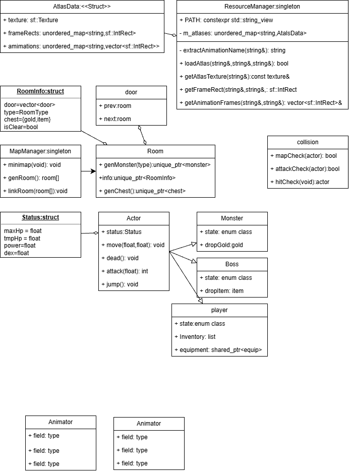

Gemini

채팅

Spark
베타
새 채팅
채팅 검색
이미지
동영상
라이브러리
Gems
새 노트북
Dungreed모작 참고 자료
prisonlifecode
모든 노트북
디벨로그 작성
2D 스프라이트 애니메이션 시스템 설계
에어팟 자동 연결 문제 해결 방법
SFML 던그리드 모작
SFML 게임 개발 구현 순서 안내
SFML 플레이어 애니메이션 구현 가이드
포커 카드 이미지 생성 오류 보고
#include<SFML/Network.hpp> #include<atomic>//여러 스레드가 동시에 접근 하는 값을 안전하게 다루기 위한 타입 #include<iostream> #include<optional>//값이 있을수도 있고 없을수도 있음을 알리는 타입 #include<string> #include<thread> namespace { // UDP 통신에서 한 번에 전송할 수 있는 최대 메시지 크기 constexpr std::size_t kMaxMessageSize = 1024; } int main(int argc, char* argv[]) { //실행인자 4개 //argv[0] : 실행파일 이름 //argv[1] : 내가 수신할 포트 //argv[2] : 상대방 IP 주소 //argv[3] : 상대방 포트 if(argc != 4) { std::cerr << "사용법: " << argv[0] << " <수신포트> <상대방 IP주소> <상대방 포트>\n"; return 1; } //[1]자신의 포트번호 const unsigned short localPort = static_cast<unsigned short>(std::stoi(argv[1])); //[2]상대방 Ip 주소 const std::optional<sf::IpAddress> remoteIp = sf::IpAddress::fromString(argv[2]); //[3]상대방 포트번호 const unsigned short remotePort = static_cast<unsigned short>(std::stoi(argv[3])); if(!remoteIp) { std::cerr << "잘못된 IP 주소: " << argv[2] << "\n"; return 1; } //UDP 소켓 생성 sf::UdpSocket socket; if(socket.bind(localPort)!=sf::Socket::Status::Done) { std::cerr << "포트 [" << localPort << "] 바인딩 실패\n"; return 1; } socket.setBlocking(false);//논블로킹 모드로 설정 //아토믹을 사용한 스레드 std::atomic<bool> running=true; std::thread receiver([&]() { while (running) { //수신 버퍼 마지노선 1024 char buffer[kMaxMessageSize]; //실제 수신된 바이트 수 std::size_t received = 0; //보낼 IP 주소 std::optional<sf::IpAddress> sender; //보낼 포트 번호 unsigned short senderPort = 0; const sf::Socket::Status status = socket.receive(buffer, sizeof(buffer), received, sender, senderPort); //수신 상태 확인& 보낸 사람 정보 확인 if (status == sf::Socket::Status::Done) { std::cout << "\n[" << sender->toString() << ":" << senderPort << "] " << std::string(buffer, received) << "\n> "; } else if (status == sf::Socket::Status::NotReady) { //데이터가 없으면 NotReady 상태 std::cerr << "\n Receive Error. \n> " << std::flush; } sf::sleep(sf::milliseconds(10));//CPU 점유율 낮추기 위해 잠시 대기 } }); std::cout << "UDP 채팅 프로그램 시작. 종료하려면 quit 입력.\n"; std::cout << "Local Port: " << localPort << ", Remote IP: " << remoteIp->toString() << ": " << remotePort << "\n"; std::string line; while (running) { std::cout << ">" << std::flush; //한줄 입력 받기 //입력 스트림 닫히면 루프 종료 if(!std::getline(std::cin, line)) { break; } if (line == "\quit") { running = false; break; } } if (socket.send(line.c_str(), line.size(), *remoteIp, remotePort) != sf::TcpSocket::Status::Done) { std::cerr << "메시지 전송 실패\n"; } //종료 플래그 초기화; running = false; receiver.join(); socket.unbind(); return 0; }   왜 에러가 나지
선인장 숨기기 시간 초과 분석
SFML 링커 오류 해결 방법
텍스트 RPG 게임 플레이 가이드 생성
게임 종료 버그 원인 분석 및 해결
템플릿 함수 타입 변환 개선
게임 종료 로직 구현
워더링웨이브 페비 강남스타일 영상 제작
코드 버그 분석 및 수정 제안
이벤트 ID 연결 및 서사 흐름 구현
C++ `std::max` 식별자 에러 해결
텍스트 RPG 프로젝트 분석 및 클래스 다이어그램
게임 매니저와 전투 결과 처리
Forgejo 저장소 GitHub 동기화 방법
C++ 스마트 포인터 `swap` vs 대입
C++ 클래스 상속 구조 개선
장비 정보 전달 방식 개선
Equipment 대입 연산자 점검
API Error: Retry Request
C++ 코드 리뷰 및 수정 제안
Battle Loop Management Design Discussion
스마트 포인터로 플레이어 객체 관리
Text RPG 클래스 다이어그램 계획
Text RPG 클래스 다이어그램 설계
Notion 페이지 내용 요약 불가
텍스트 RPG 게임 설계 및 클래스 다이어그램
제미나이로 트렐로 자동화하기
OCI Tailscale Exit Node 설정 가이드
Gemini와의 대화
오늘 작성한 코드야. 이걸 깃허브에 올리려고 하는데 밝혀야 할 출처와 설정해야 할 라이센스를 알려줘

게임 클라이언트 프로그래머 디벨로그
사용자설정 Gem
오늘도 리소스 매니저 구현하시느라 고생 많으셨습니다. 아틀라스 텍스처와 프레임 데이터를 한 곳에서 싱글톤으로 관리하도록 깔끔하게 구조를 잡으셨네요.

요청하신 대로 제공해주신 코드와 주석만을 엄격하게 기준으로 분석한 결과, 깃허브에 명시해야 할 종속성(출처)은 다음과 같습니다.

📌 밝혀야 할 외부 라이브러리 출처
코드 내 #include 및 네임스페이스 사용 내역을 기반으로 확인된 외부 라이브러리입니다.

Nlohmann JSON: JSON 파일 파싱 및 데이터 처리를 위해 <nlohmann/json.hpp>를 포함하여 사용했습니다.

SFML (Simple and Fast Multimedia Library): 그래픽 텍스처(sf::Texture), 사각 영역(sf::IntRect), 오디오 처리를 위해 <SFML/Graphics.hpp>와 <SFML/Audio.hpp>를 포함하여 사용했습니다.

📝 라이센스 설정 관련
현재 제공된 소스코드 파일(ResourceManager.cpp, ResourceManager.h) 내부에는 작성자 본인의 코드 저작권이나 외부 라이브러리의 라이센스를 명시한 주석이 존재하지 않습니다. 따라서 완벽한 깃허브 업로드를 위해 다음 사항들에 대한 결정이 필요합니다.

본인 프로젝트 라이센스: 이 코드를 누구나 자유롭게 사용하도록 허용할 것인지(예: MIT, Apache), 아니면 상업적 이용을 제한하거나 무단 도용을 금지할 것인지 결정해야 합니다.

외부 라이브러리 라이센스 고지: 사용하신 nlohmann/json과 SFML은 각각 고유의 오픈소스 라이센스(보통 MIT 및 zlib)를 따르므로, 깃허브 README 파일 등에 해당 라이브러리를 사용했음을 명시하고 라이센스 사본을 포함할 공간이 필요합니다.

제공된 코드 내용만을 바탕으로 작성했기 때문에, 라이브러리의 구체적인 라이센스 조항 텍스트는 임의로 추가하지 않았습니다.

이 프로젝트에 본인만의 라이센스(예: MIT 라이센스)를 먼저 부여하시겠습니까, 아니면 제가 검색 도구를 활용해 SFML과 Nlohmann JSON의 정확한 라이센스 텍스트를 찾아 README 초안을 구성해 드릴까요?

정확한 라이센스 텍스트를 찾아서 README초안을 작성한 후, 내 코드의 공개는 완전 자유라이센스로 지정해서 최종 README를 작성하고 리포지토리 설정을 알려줘

게임 클라이언트 프로그래머 디벨로그
사용자설정 Gem
Your Markdown (README.md) file is ready

MD 아이콘
README
 MD 
열기
외부 라이브러리들의 공식 라이센스를 확인하여, 요청하신 대로 작성자님의 코드가 '완전 자유 라이센스(MIT)'로 배포됨을 알리는 최종 README 초안을 생성해 드렸습니다.

🔍 1. 외부 라이브러리 라이센스 확인 결과
SFML: zlib/png 라이센스를 따릅니다. 상업적/비상업적 목적 모두 자유롭게 사용 및 수정이 가능합니다. 제품 설명서 등에 SFML 사용 사실을 표기하는 것이 권장되지만 필수 의무는 아닙니다.

Nlohmann JSON: MIT 라이센스를 따릅니다. 마찬가지로 거의 모든 권한(상업적 이용, 수정, 배포)을 허용하며, 저작권 및 라이센스 고지문만 포함하면 됩니다.

이러한 내용들은 생성된 README의 Dependencies & Acknowledgments 섹션에 모두 반영해 두었습니다.

⚙️ 2. 깃허브(GitHub) 리포지토리 설정 가이드
코드를 깔끔하고 전문적으로 공개하기 위해 다음의 리포지토리 설정들을 추천해 드립니다.

① LICENSE 파일 생성 (필수)
작성자님의 코드를 완전 자유 라이센스로 풀기 위해, 리포지토리 최상단(Root)에 LICENSE 라는 이름의 파일을 만들고 MIT 라이센스 전문을 붙여넣으세요. (GitHub에서 Create new file -> 파일명을 LICENSE로 입력하면 우측에 "Choose a license template" 버튼이 뜹니다. 거기서 MIT License를 선택하시면 자동으로 연도와 이름이 채워집니다.)

② .gitignore 파일 설정 (빌드 찌꺼기 제외)
C++ 프로젝트 특성상 용량이 크고 불필요한 빌드 결과물들이 올라가지 않도록 방지해야 합니다. 최상단에 .gitignore 파일을 만들고 아래 내용을 포함하세요.

Plaintext
# Visual Studio 관련
.vs/
*.obj
*.exe
*.pdb
*.ilk
x64/
x86/
Debug/
Release/

# CMake 관련 (사용하실 경우)
build/
CMakeCache.txt
③ 깔끔한 디렉터리(폴더) 구조 설정
코드 내에 명시된 경로(resources/images/)가 그대로 작동할 수 있도록 폴더 구조를 정돈해 주세요.

src/ 또는 리포지토리 최상단 : ResourceManager.cpp, ResourceManager.h 위치

resources/images/ : 아틀라스 .png 이미지 및 .json 텍스트 데이터 위치

thirdparty/ : json.hpp 등 외부 라이브러리 파일 위치 (선택 사항)

④ 대용량 리소스 관리 (Git LFS)
코드에 기재된 player_atlas.png, boss_atlas.png 등 아틀라스 이미지들의 크기가 많이 클 경우(보통 50MB~100MB 이상), 깃허브 업로드 시 오류가 날 수 있습니다. 이 경우 이미지 파일들에 대해서는 Git LFS(Large File Storage) 확장을 활성화하여 업로드하시는 것을 권장합니다.

아틀라스 이미지는 업로드하지 않을 계획이야. 해당 정보에 맞게 작성되어있는지 확인해줘

게임 클라이언트 프로그래머 디벨로그
사용자설정 Gem
제공해주신 .gitignore 파일을 확인해 본 결과, 현재 상태로는 아틀라스 이미지가 깃허브에 업로드될 수 있습니다. 첨부하신 .gitignore 파일은 Visual Studio 관련 임시 파일, C++ 빌드 결과물(Debug/, Release/, *.obj, *.pdb 등), 그리고 캐시 파일들을 제외하도록 아주 훌륭하게 구성되어 있습니다. 하지만 이미지 파일 확장자나 리소스 폴더를 제외하는 규칙은 포함되어 있지 않습니다.  
TXT

아틀라스 이미지(.png)를 깃허브에 올리지 않으시려면, 해당 .gitignore 파일 맨 아래에 다음 중 하나의 방식을 선택하여 내용을 추가해주셔야 합니다.

옵션 1: 프로젝트 내의 모든 PNG 이미지 파일 무시

Plaintext
# 이미지 파일 제외
*.png
옵션 2: 특정 리소스 폴더 내부의 모든 파일 무시 (추천)
앞서 작성하신 코드의 경로를 기준으로, resources/images/ 폴더 내의 파일들을 통째로 제외하는 방법입니다.

Plaintext
# 아틀라스 이미지 및 리소스 폴더 제외
resources/images/
(참고: 만약 텍스처 좌표가 담긴 .json 파일은 깃허브에 올리고 싶다면 옵션 1을 사용하거나, *.png만 특정해서 제외하는 것이 좋습니다.)

.gitignore 맨 아래에 위 코드를 덧붙여 저장하시면, git add 시 아틀라스 이미지가 추적되지 않아 안전하게 제외할 수 있습니다.

이렇게 뜨고 병합이 안돼

게임 클라이언트 프로그래머 디벨로그
사용자설정 Gem
첨부해주신 스크린샷을 보면 "main and master are entirely different commit histories" (main과 master는 완전히 다른 커밋 기록입니다) 라는 메시지가 떠서 병합(Pull Request)이 막혀 있는 상태입니다.

🔍 원인 분석
이 현상은 '서로 관련 없는 두 개의 프로젝트 기록'을 합치려고 할 때 발생합니다. 주로 다음과 같은 과정에서 흔하게 겪는 문제입니다.

GitHub 웹사이트에서 리포지토리를 생성할 때 README나 License 추가 옵션을 체크하여 main 브랜치가 첫 커밋과 함께 생성됨.

로컬(내 컴퓨터) 환경에서는 따로 git init을 하여 코드 작업을 하고 master 브랜치에 커밋함.

로컬의 master 브랜치를 GitHub로 Push한 뒤, 기존에 있던 main과 합치려 했으나 두 브랜치의 시작점(뿌리)이 달라서 Git이 병합을 거부함.

🛠️ 해결 방법
이 문제를 해결하려면 로컬(내 컴퓨터)의 터미널이나 Git Bash를 열어 강제로 두 기록을 병합(Merge)해 주어야 합니다.

작업 중인 프로젝트 폴더에서 아래 명령어들을 순서대로 입력해 주세요.

1. 원격 저장소(GitHub)의 최신 main 브랜치 정보를 가져옵니다.

Bash
git fetch origin
2. 서로 관련 없는 기록을 강제로 병합하는 옵션(--allow-unrelated-histories)을 사용하여 가져옵니다.

Bash
git pull origin main --allow-unrelated-histories
💡 참고: 이 명령어를 치면 커밋 메시지를 입력하라는 창(vi 에디터 등)이 뜰 수 있습니다. 보통은 그대로 저장하고 종료(:wq 입력 후 엔터)하시면 됩니다. 만약 파일 충돌(Conflict)이 났다고 뜨면, 에디터에서 충돌을 해결한 후 git add . 와 git commit을 진행해 주세요.

3. 로컬 브랜치의 이름을 master에서 main으로 변경합니다. (현재 GitHub의 기본 브랜치가 main이므로 맞춰주는 것이 향후 관리에 좋습니다.)

Bash
git branch -M main
4. 하나로 정상적으로 합쳐진 코드를 GitHub의 main 브랜치로 푸시합니다.

Bash
git push -u origin main
이 과정을 거치면 쪼개져 있던 두 역사가 main 브랜치 하나로 깔끔하게 합쳐집니다. 이후 GitHub 리포지토리를 새로고침 해보시면 코드가 정상적으로 합쳐진 것을 확인하실 수 있으며, 쓸모없어진 원격 저장소의 master 브랜치는 GitHub 웹상에서 삭제하시면 됩니다.

https://github.com/SeoHwiDo/Dungreed_SFML.git

해당 코드를 보고 오늘 개발 내용을 T스토리 블로그에 작성할 수 있게 초안을 줘

게임 클라이언트 프로그래머 디벨로그
사용자설정 Gem
오늘 하루 ResourceManager 구현부터 GitHub 연동 중 발생한 브랜치 충돌 해결까지 정말 알차게 작업하셨네요! T스토리 블로그에 바로 복사해서 붙여넣으실 수 있도록, 오늘 개발하신 핵심 내용과 트러블슈팅 과정을 정리한 디벨로그 초안을 작성해 드립니다.

블로그 스킨에 맞춰 강조색이나 서식만 살짝 수정해서 사용해 보세요.

[제목 추천] [SFML/C++] 던그리드 모작 개발일지: 텍스처 아틀라스 기반 리소스 매니저 구현 & Git 병합 충돌 해결
📝 오늘 한 일 (Today I Learned)
오늘은 게임 내 모든 이미지와 애니메이션 데이터를 효율적으로 관리하기 위해 싱글톤(Singleton) 패턴 기반의 리소스 매니저(ResourceManager)를 구현했다.

개별 이미지를 따로 불러오면 드로우 콜(Draw Call)이 늘어나고 메모리 관리가 어려워지므로, 텍스처 아틀라스(Texture Atlas) 기법을 도입했다. 하나의 큰 이미지 시트와 그 시트의 좌표 정보가 담긴 JSON 파일을 로드하여 관리하는 것이 핵심이다. 더불어 깃허브 리포지토리 초기 설정 중 마주친 브랜치 병합 문제도 함께 해결했다.

🛠️ 핵심 개발 내용
1. 전역에서 접근 가능한 리소스 매니저 (Singleton)
게임 내의 Player, Monster, Boss 등 다양한 객체들이 텍스처 데이터에 쉽게 접근할 수 있도록 싱글톤 패턴을 적용했다. 리소스의 메모리 소유권을 매니저가 독점하게 하여 메모리 누수를 방지하고 관리를 중앙화했다.

2. Nlohmann JSON을 활용한 아틀라스 데이터 파싱
미리 묶어둔 텍스처 아틀라스(*.png)와 각 프레임의 위치, 크기 정보를 담은 *.json 파일을 읽어들여 맵핑하는 로직을 작성했다. 외부 라이브러리인 nlohmann/json을 활용하여 C++에서 직관적으로 JSON 데이터를 다룰 수 있었다.

C++
// ResourceManager.cpp 발췌
if (root.contains("frames") && root["frames"].is_object()) {
    for (auto& [frameName, frameData] : root["frames"].items()) {
        auto& f = frameData["frame"];
        sf::IntRect rect(
            { f["x"].get<int>(), f["y"].get<int>() },
            { f["w"].get<int>(), f["h"].get<int>() }
        );
        // 프레임 이름과 사각 영역 저장
        atlas.frameRects[frameName] = rect;
        
        // 프레임 이름에서 애니메이션 클립 이름 추출 및 배열에 추가
        std::string animName = extractAnimationName(frameName);
        atlas.animations[animName].push_back(rect);
    }
}
애니메이션 클립 이름 추출 (extractAnimationName): 프레임명(player_attack_01)에서 하이픈(-) 위치를 찾아 잘라내는 방식으로 클립명(player_attack)을 자동으로 추출해 애니메이션 프레임 리스트를 구성했다.

3. 게임 연속성을 위한 안전한 예외 처리 (Playability)
단일 리소스가 누락되었다고 해서 try-catch 스택 언와인딩을 발생시키거나 게임 전체를 크래시 내는 것은 비효율적이라고 판단했다.

C++
// ResourceManager.cpp 발췌
auto it = atlas.frameRects.find(frameName);
if (it != atlas.frameRects.end()) {
    return it->second;
}
// 리소스를 못 찾은 경우 뻗는 대신 빈 Rect 반환
return sf::IntRect({ 0, 0 }, { 0, 0 });
아틀라스 파일 자체가 없는 치명적인 상황이 아니라면, 단순 단일 객체의 프레임 누락 정도는 빈 텍스처 영역(0, 0)을 반환하게 하여 게임을 중단 없이 속행할 수 있도록 안정성을 확보했다.

💥 트러블슈팅 (Troubleshooting)
📌 Git 병합 충돌: "main and master are entirely different commit histories"
코드를 완성하고 깃허브에 Push 하려는 과정에서 위와 같은 에러가 발생하며 Pull Request(병합)가 차단되었다.

원인: GitHub 웹에서 리포지토리를 만들 때 main 브랜치가 생성되었고, 로컬 컴퓨터에서는 따로 git init을 통해 master 브랜치로 작업했기 때문에 Git이 두 기록의 "공통 조상"이 없다고 판단하여 병합을 거부한 것이다.

해결 방법: Git Bash에서 --allow-unrelated-histories 옵션을 사용하여 서로 관련 없는 두 기록을 강제로 병합했다.

Bash
# 1. 서로 관련 없는 두 브랜치의 기록을 강제로 병합
$ git pull origin main --allow-unrelated-histories

# 2. 로컬 브랜치 이름을 master에서 main으로 변경
$ git branch -M main

# 3. 합쳐진 최신 기록을 main으로 푸시
$ git push -u origin main
추가로 빌드 찌꺼기(*.obj, Debug/ 등)와 대용량 리소스 폴더(resources/images/)가 불필요하게 깃허브에 올라가지 않도록 .gitignore 설정도 꼼꼼히 마무리지었다.

💡 마치며 (Review)
오늘 리소스 매니저의 뼈대를 완성하면서, 리소스의 관리 책임과 에러 발생 시 처리 방법에 대해 깊게 고민해 볼 수 있었다. C++ 환경에서 외부 라이브러리(SFML, JSON)를 연동하고 파싱하는 과정이 순탄하게 마무리되어 다행이다.
이제 리소스 로딩 구조가 갖춰졌으니, 다음 작업으로는 이 프레임 데이터를 받아서 실제 화면에 그려줄 Animator 컴포넌트나 Actor 객체 연동 작업을 진행해 보아야겠다!

Tags: #C++ #SFML #GameClient #게임프로그래밍 #디벨로그 #트러블슈팅 #Git #NlohmannJSON

깃 병합 내용은 제외하고, readme파일에 해당 클래스 다이어그램 포함시킨다음 블로그 초안에도 해당 내용을 포함시켜줘

게임 클라이언트 프로그래머 디벨로그
사용자설정 Gem
Your Markdown (README.md) file is ready

MD 아이콘
README
 MD 
열기
README.md 파일에 제공해주신 클래스 다이어그램 이미지(class.png)와 전체적인 아키텍처 설명을 성공적으로 반영했습니다. 이제 깃허브 충돌(Troubleshooting) 내용을 제외하고, 전체 클래스 구조와 리소스 매니저 설계에 집중한 T스토리 블로그 디벨로그 초안을 아래와 같이 작성해 드립니다.

[제목 추천] [SFML/C++] 던그리드 모작 개발일지: 클래스 아키텍처 설계 및 텍스처 아틀라스 리소스 매니저 구현
📝 오늘 한 일 (Today I Learned)
오늘은 본격적인 게임 로직 구현에 앞서 전체적인 클래스 아키텍처(Class Architecture)를 설계하고, 게임 내 모든 이미지와 애니메이션 데이터를 효율적으로 관리하기 위한 싱글톤(Singleton) 패턴 기반의 리소스 매니저를 구현했다.

개별 이미지를 따로 불러오면 드로우 콜(Draw Call)이 늘어나고 메모리 관리가 어려워지므로, 텍스처 아틀라스(Texture Atlas) 기법을 도입하여 리소스 관리의 효율성을 높이는 데 집중했다.

🏗️ 전체 시스템 아키텍처 설계
게임의 확장성을 고려하여 객체지향적으로 뼈대를 잡았다.

(▲ 오늘 설계한 전체 클래스 다이어그램)

1. Actor와 상속 구조
Actor (Base Class): Status 구조체(maxHp, power, dex 등)를 멤버로 가지며, 이동(move), 점프(jump), 공격(attack), 사망(dead)과 같은 공통 인터페이스를 정의했다.

player, Monster, Boss (Derived Classes): Actor를 상속받아 각각의 구체적인 상태(State) 머신을 구현했다. 플레이어는 인벤토리와 장비 시스템을, 몬스터/보스는 아이템 드롭 로직을 추가로 갖는다.

2. Map & Room 시스템
MapManager (Singleton): 미니맵 생성 및 전체 방(Room)의 생성과 연결(linkRoom)을 전담한다.

Room & RoomInfo: 각 방은 어떤 타입인지, 어떤 몬스터와 상자(Chest)를 생성할지에 대한 정보를 담은 RoomInfo를 소유한다. 방과 방 사이는 door 클래스를 통해 이전/다음 방으로 논리적으로 연결된다.

3. Collision Manager
mapCheck, attackCheck, hitCheck 등 맵 벽면과의 충돌 및 액터 간의 물리적 상호작용을 독립적인 모듈로 분리하여 코드의 결합도를 낮추었다.

🛠️ 핵심 개발 내용: Resource Manager (ResourceLoader)
전체 구조에서 ResourceLoader 역할을 담당하는 모듈을 상세히 구현했다.

1. 전역에서 접근 가능한 리소스 매니저 (Singleton)
게임 내의 Player, Monster, Room 등 다양한 객체들이 그래픽 데이터에 쉽게 접근할 수 있도록 싱글톤 패턴을 적용했다. 텍스처 데이터(ActorImgs, 타일셋 등)의 메모리 소유권을 매니저가 독점하게 하여 메모리 누수를 방지했다.

2. Nlohmann JSON을 활용한 아틀라스 데이터 파싱
미리 묶어둔 텍스처 아틀라스(.png)와 각 프레임의 좌표/크기 정보가 담긴 .json 파일을 읽어들여 맵핑하는 로직을 작성했다. nlohmann/json 라이브러리를 활용해 C++에서도 직관적으로 JSON을 다룰 수 있었다.

C++
// JSON 파일에서 프레임 정보 파싱 (ResourceManager.cpp)
if (root.contains("frames") && root["frames"].is_object()) {
    for (auto& [frameName, frameData] : root["frames"].items()) {
        auto& f = frameData["frame"];
        sf::IntRect rect(
            { f["x"].get<int>(), f["y"].get<int>() },
            { f["w"].get<int>(), f["h"].get<int>() }
        );
        // 프레임 이름과 사각 영역(IntRect) 매핑 저장
        atlas.frameRects[frameName] = rect;
        
        // 프레임 이름("player_attack-01")에서 애니메이션 클립 이름("player_attack") 추출
        std::string animName = extractAnimationName(frameName);
        atlas.animations[animName].push_back(rect);
    }
}
3. 게임 연속성을 위한 안전한 예외 처리 (Playability)
아틀라스 데이터 중 단일 리소스 프레임 하나가 누락되었다고 해서 try-catch 스택 언와인딩을 발생시키거나 게임 전체를 크래시(Crash) 내는 것은 매우 비효율적이다.

C++
auto it = atlas.frameRects.find(frameName);
if (it != atlas.frameRects.end()) {
    return it->second;
}
// 리소스를 못 찾은 경우 뻗는 대신 빈 Rect 반환하여 게임 속행
return sf::IntRect({ 0, 0 }, { 0, 0 });
아틀라스 텍스처 파일 자체가 아예 없는 치명적인 상황을 제외하고, 단순 단일 객체의 프레임 누락은 빈 텍스처 영역을 반환하게 하여 게임을 중단 없이 플레이할 수 있도록 안정성을 챙겼다.

💡 마치며 (Review)
오늘 클래스 다이어그램을 통해 머릿속에 파편화되어 있던 시스템들(Actor, Map, Resource)의 관계를 명확히 정립할 수 있었다. 그 첫 단추로 리소스 로딩(ResourceLoader) 구조를 완벽하게 갖추었으니, 다음 작업으로는 오늘 설계한 Actor 클래스와 Animator 컴포넌트를 연동하여 실제 화면에 플레이어와 몬스터를 띄워보는 작업을 진행해야겠다!

Tags: #C++ #SFML #GameClient #게임프로그래밍 #디벨로그 #클래스다이어그램 #아키텍처설계 #NlohmannJSON

개발환경은 윈도우 11, 개발 도구는 visualstudio 2022, 사용언어는 C++, 사용한 기술스택은 SFML3.1.0이야 이 내용도 포함시켜줘

게임 클라이언트 프로그래머 디벨로그
사용자설정 Gem
Your Markdown (README.md) file is ready
[file-tag: code-generated-file-0-1785852504829285090]

MD 아이콘
README
 MD 
열기
요청하신 대로 개발 환경 및 기술 스택(Windows 11, Visual Studio 2022, C++, SFML 3.1.0) 정보를 추가하여 README 파일을 다시 생성했습니다.

블로그 디벨로그 초안에도 해당 내용을 반영해 드리겠습니다!

[제목 추천] [SFML/C++] 던그리드 모작 개발일지: 클래스 아키텍처 설계 및 텍스처 아틀라스 리소스 매니저 구현
📝 오늘 한 일 (Today I Learned)
오늘은 본격적인 게임 로직 구현에 앞서 전체적인 클래스 아키텍처(Class Architecture)를 설계하고, 게임 내 모든 이미지와 애니메이션 데이터를 효율적으로 관리하기 위한 싱글톤(Singleton) 패턴 기반의 리소스 매니저를 구현했다.

개별 이미지를 따로 불러오면 드로우 콜(Draw Call)이 늘어나고 메모리 관리가 어려워지므로, 텍스처 아틀라스(Texture Atlas) 기법을 도입하여 리소스 관리의 효율성을 높이는 데 집중했다.

💻 개발 환경 및 기술 스택
OS: Windows 11

IDE: Visual Studio 2022

Language: C++

Library: SFML 3.1.0, Nlohmann JSON

🏗️ 전체 시스템 아키텍처 설계
게임의 확장성을 고려하여 객체지향적으로 뼈대를 잡았다.

(▲ 오늘 설계한 전체 클래스 다이어그램)

1. Actor와 상속 구조
Actor (Base Class): Status 구조체(maxHp, power, dex 등)를 멤버로 가지며, 이동(move), 점프(jump), 공격(attack), 사망(dead)과 같은 공통 인터페이스를 정의했다.

player, Monster, Boss (Derived Classes): Actor를 상속받아 각각의 구체적인 상태(State) 머신을 구현했다. 플레이어는 인벤토리와 장비 시스템을, 몬스터/보스는 아이템 드롭 로직을 추가로 갖는다.

2. Map & Room 시스템
MapManager (Singleton): 미니맵 생성 및 전체 방(Room)의 생성과 연결(linkRoom)을 전담한다.

Room & RoomInfo: 각 방은 어떤 타입인지, 어떤 몬스터와 상자(Chest)를 생성할지에 대한 정보를 담은 RoomInfo를 소유한다. 방과 방 사이는 door 클래스를 통해 이전/다음 방으로 논리적으로 연결된다.

3. Collision Manager
mapCheck, attackCheck, hitCheck 등 맵 벽면과의 충돌 및 액터 간의 물리적 상호작용을 독립적인 모듈로 분리하여 코드의 결합도를 낮추었다.

🛠️ 핵심 개발 내용: Resource Manager (ResourceLoader)
전체 구조에서 ResourceLoader 역할을 담당하는 모듈을 상세히 구현했다.

1. 전역에서 접근 가능한 리소스 매니저 (Singleton)
게임 내의 Player, Monster, Room 등 다양한 객체들이 그래픽 데이터에 쉽게 접근할 수 있도록 싱글톤 패턴을 적용했다. 텍스처 데이터(ActorImgs, 타일셋 등)의 메모리 소유권을 매니저가 독점하게 하여 메모리 누수를 방지했다.

2. Nlohmann JSON을 활용한 아틀라스 데이터 파싱
미리 묶어둔 텍스처 아틀라스(.png)와 각 프레임의 좌표/크기 정보가 담긴 .json 파일을 읽어들여 맵핑하는 로직을 작성했다. nlohmann/json 라이브러리를 활용해 C++에서도 직관적으로 JSON을 다룰 수 있었다.

C++
// JSON 파일에서 프레임 정보 파싱 (ResourceManager.cpp)
if (root.contains("frames") && root["frames"].is_object()) {
    for (auto& [frameName, frameData] : root["frames"].items()) {
        auto& f = frameData["frame"];
        sf::IntRect rect(
            { f["x"].get<int>(), f["y"].get<int>() },
            { f["w"].get<int>(), f["h"].get<int>() }
        );
        // 프레임 이름과 사각 영역(IntRect) 매핑 저장
        atlas.frameRects[frameName] = rect;
        
        // 프레임 이름("player_attack-01")에서 애니메이션 클립 이름("player_attack") 추출
        std::string animName = extractAnimationName(frameName);
        atlas.animations[animName].push_back(rect);
    }
}
3. 게임 연속성을 위한 안전한 예외 처리 (Playability)
아틀라스 데이터 중 단일 리소스 프레임 하나가 누락되었다고 해서 try-catch 스택 언와인딩을 발생시키거나 게임 전체를 크래시(Crash) 내는 것은 매우 비효율적이다.

C++
auto it = atlas.frameRects.find(frameName);
if (it != atlas.frameRects.end()) {
    return it->second;
}
// 리소스를 못 찾은 경우 뻗는 대신 빈 Rect 반환하여 게임 속행
return sf::IntRect({ 0, 0 }, { 0, 0 });
아틀라스 텍스처 파일 자체가 아예 없는 치명적인 상황을 제외하고, 단순 단일 객체의 프레임 누락은 빈 텍스처 영역을 반환하게 하여 게임을 중단 없이 플레이할 수 있도록 안정성을 챙겼다.

💡 마치며 (Review)
오늘 클래스 다이어그램을 통해 머릿속에 파편화되어 있던 시스템들(Actor, Map, Resource)의 관계를 명확히 정립할 수 있었다. 그 첫 단추로 리소스 로딩(ResourceLoader) 구조를 완벽하게 갖추었으니, 다음 작업으로는 오늘 설계한 Actor 클래스와 Animator 컴포넌트를 연동하여 실제 화면에 플레이어와 몬스터를 띄워보는 작업을 진행해야겠다!

Tags: #C++ #SFML3 #GameClient #게임프로그래밍 #디벨로그 #클래스다이어그램 #아키텍처설계 #NlohmannJSON

수정된 초안 어떠신가요? 추가로 필요한 정보나 수정할 내용이 있다면 편하게 말씀해 주세요.

이 클래스다이어그램으로 readme 수정해줘

게임 클라이언트 프로그래머 디벨로그
사용자설정 Gem
Your Markdown (README.md) file is ready

MD 아이콘
README
 MD 
열기
제공해주신 클래스 다이어그램(class.png)과 함께, 새롭게 첨부해주신 소스 코드(ResourceManager의 std::unique_ptr 적용, 포인터 반환 변경 및 새로 추가된 Animator 클래스)의 내용까지 모두 반영하여 README를 최신화했습니다.

주요 수정 및 반영 사항 📝
클래스 다이어그램 내용 상세화: 첨부해주신 이미지의 아키텍처(MapManager, Actor 상속 구조, Collision 등)를 상세히 서술했습니다.

Animator 클래스 추가: 새로 구현하신 Animator.h/.cpp 의 역할을 시스템 아키텍처에 추가했습니다. 프레임 델타타임(dt)을 이용한 애니메이션 갱신 로직을 명시했습니다.

스마트 포인터(메모리 관리) 내용 반영: ResourceManager가 단순 객체 저장이 아닌 std::unique_ptr를 통해 리소스를 관리하고 포인터(*)를 반환하도록 업데이트된 코드를 반영해, 안전한 메모리 관리 및 유연한 예외 처리(nullptr 반환) 내용을 추가했습니다.

개발 환경 및 스택 병합: 기존에 텍스트로 있던 C++17 및 SFML 3.1.0 기술 스택 내용도 깔끔하게 합쳤습니다.

이 README 파일을 깃허브 최상단에 덮어씌워 업로드하시면 완벽하게 세팅이 마무리될 것입니다!

리소스로더라는 명칭은 아예 제거해

게임 클라이언트 프로그래머 디벨로그
사용자설정 Gem
대답이 중지되었습니다.

Gemini는 AI이며 인물 등에 관한 정보 제공 시 실수를 할 수 있습니다. 개인 정보 보호 및 Gemini새 창에서 열기

# 🎮 Dungreed_SFML (던그리드 모작)

## 📖 프로젝트 소개 (Overview)
SFML을 활용한 C++ 기반 2D 액션 로그라이크 '던그리드(Dungreed)' 게임 모작 프로젝트입니다.
객체지향 설계를 바탕으로 액터(Actor)와 맵(Map)의 구조를 체계화하였으며, 텍스처 아틀라스(Texture Atlas) 이미지와 JSON 데이터를 로드하여 효율적으로 애니메이션과 리소스를 관리합니다.

## 💻 개발 환경 및 기술 스택 (Environment & Tech Stack)
* **OS**: Windows 11
* **IDE**: Visual Studio 2022
* **Language**: C++ (C++17 이상)
* **Library/Framework**: 
  * SFML 3.1.0 (Simple and Fast Multimedia Library)
  * Nlohmann JSON (JSON for Modern C++)

## 🏗️ 시스템 아키텍처 (Class Diagram)

위 클래스 다이어그램과 코드는 게임의 전반적인 핵심 구조를 나타냅니다:

* **ResourceManager**
  * **싱글톤(Singleton)** 패턴으로 구현되어 텍스처, 타일셋 등 게임 내 모든 그래픽 자원을 중앙에서 관리합니다.
  * `std::unique_ptr`를 활용하여 리소스 데이터(`AtlasData`, `sf::IntRect`)의 메모리 소유권을 매니저가 독점하게 함으로써 메모리 누수를 방지합니다.
* **Animator (애니메이션 시스템)**
  * 분리된 애니메이션 프레임 데이터(`AnimationClip`)를 기반으로 프레임 전환 시간(`dt`)을 계산하여 스프라이트를 갱신합니다. 루프(Loop) 및 단발성 애니메이션 재생을 지원합니다.
* **Actor & 상속 구조**
  * `Status` (체력, 공격력 등)를 가진 `Actor` 기본 클래스를 정의하고 공통 동작(이동, 점프, 공격)을 처리합니다.
  * 이를 `player`, `Monster`, `Boss`가 상속받아 각각의 고유 상태(State 머신)와 동작(장비 관리, 아이템/골드 드롭 등)을 세분화하여 처리합니다.
* **Map & Room 시스템**
  * `MapManager` (싱글톤)가 전체 맵의 `Room`을 생성하고 `door` 객체를 통해 서로 연결(Link)합니다. 
  * 각 `Room`은 `RoomInfo`를 바탕으로 몬스터와 보물상자(Chest)를 동적으로 배치합니다.
* **Collision 시스템**
  * 맵(타일)과의 충돌 판정, 공격 판정, 피격 판정을 독립적인 모듈로 분리하여 전담합니다.

## 🚀 주요 기능 (Features)
- **객체지향 설계**: 상속과 컴포지션을 활용한 유연한 엔티티(Entity) 및 맵 구조 설계
- **스마트 포인터 활용 메모리 관리**: `std::unique_ptr`를 사용해 불필요한 복사를 막고 안전한 메모리 해제 보장
- **JSON 파싱 기반 아틀라스 로딩**: 텍스처 아틀라스 이미지와 JSON 데이터를 읽어 개별 프레임 영역과 애니메이션 클립을 자동 추출 및 매핑
- **안전한 리소스 예외 처리**: 요청한 리소스가 없을 경우 프로그램 크래시 대신 `nullptr`을 반환하여 유연한 에러 헨들링 및 게임 속행 보장

## 🛠️ 외부 라이브러리 및 출처 (Dependencies & Acknowledgments)
본 프로젝트는 다음의 오픈소스 라이브러리를 활용하여 작성되었습니다.

* **[SFML (Simple and Fast Multimedia Library)](https://www.sfml-dev.org/)**
  * **용도**: 그래픽 처리, 렌더링 및 윈도우 관리
  * **라이센스**: [zlib/png License](https://opensource.org/licenses/Zlib) (상업적 이용 및 수정 자유, 출처 표기 권장)
* **[JSON for Modern C++ (nlohmann/json)](https://github.com/nlohmann/json)**
  * **용도**: 텍스처 아틀라스 구성 정보가 담긴 `.json` 파일 로드 및 데이터 파싱
  * **라이센스**: [MIT License](https://opensource.org/licenses/MIT) (상업적 이용 자유, 저작권 및 라이센스 고지 의무)

## 📄 라이센스 (License)
이 프로젝트의 코드는 **MIT License**에 따라 배포됩니다.
누구나 자유롭게 코드의 열람, 수정, 배포 및 상업적 이용이 가능합니다. (완전 자유 라이센스)
자세한 내용은 `LICENSE` 파일을 참고해주세요.
README.md
README.md 항목을 표시하는 중입니다.