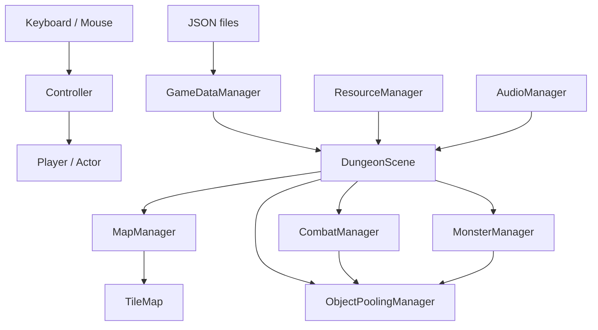

# Dungreed SFML - 2D 액션 로그라이크 모작

SFML과 C++17로 구현한 2D 액션 로그라이크 모작 프로젝트입니다. 플레이어의 이동·점프·대시·조준, 근접/원거리 전투, 랜덤 던전 진행, 몬스터 AI, 보스전, 보상, UI까지 하나의 실시간 게임 루프로 구성했습니다.

콘텐츠 데이터는 JSON으로 분리하고, 런타임에는 객체 풀과 사전 생성을 적용해 맵 전환 및 다수 투사체 상황을 고려했습니다.

> 개인 학습 및 클라이언트 프로그래머 포트폴리오 목적의 모작 프로젝트입니다.


## 기술 스택

| 구분 | 내용 |
| --- | --- |
| Language | C++17 |
| Framework | SFML 3.1.0 |
| Data | nlohmann/json |
| IDE / Platform | Visual Studio 2022 / Windows |
| Build | Visual Studio Solution (`Dungreed.sln`) |

## 구현 범위

### 입력, 플레이어, 기본 물리

- `Controller`는 키보드·마우스 입력을 읽어 `Player`에 전달합니다.
- 이동은 `A/D` 또는 방향키, 점프는 `W` 또는 `Space`, 대시는 `Shift` 또는 마우스 오른쪽 버튼으로 처리합니다.
- 마우스 좌표를 월드 좌표로 변환하고 `atan2`를 사용해 360도 조준 방향을 계산합니다.
- `Actor`는 이동 속도, 중력, 점프, 넉백, 피격 피드백 등 공통 물리 상태를 관리합니다.
- `Player`는 대시, 조준 방향, 장비 공격, 사망 상태를 담당합니다.
- `Collision`은 타일 충돌과 일방 통행 발판(`OneWay`)을 처리하고, 투사체의 벽 충돌도 별도로 판정합니다.
- `Camera`는 플레이어 또는 보스 연출 대상에 맞춰 뷰 중심과 줌을 갱신합니다.

### 전투, 적 AI, 보스

- `CombatManager`가 플레이어 공격, 몬스터 공격, 투사체 갱신 및 피격 처리를 프레임 단위로 조율합니다.
- 근접 공격은 스윙 이펙트와 무기 히트박스를 함께 활용하며, 이펙트별 대상 적중 기록으로 동일 대상의 중복 타격을 제한합니다.
- 원거리 공격은 `ProjectileSpawnRequest`로 요청을 만들고, 실제 투사체 생성·회수는 객체 풀에 위임합니다.
- `MonsterManager`는 활성 몬스터의 AI·물리·장비 갱신을 담당합니다.
- 비행형/지상형 적, 추적·공격 상태, 돌진 콤보, 방사형 투사체 등 서로 다른 몬스터 행동을 데이터로 구성합니다.
- `Boss` / `SkelBoss`는 일반 적과 분리된 보스 전투·소환 연출·보스 전용 투사체 흐름을 제공합니다.

### 데이터 주도 콘텐츠 설계

다음 데이터는 `Dungreed/resources/data`의 JSON에서 읽어 런타임 구조체로 변환합니다.

- `weapons.json`: 공격 타입, 공격력, 공격 속도, 사거리, 투사체 수·속도·수명·퍼짐
- `actor_data.json`: 플레이어와 액터 공통 데이터
- `monsters.json`: 상태값, 이동 방식, AI 감지/공격 범위, 애니메이션, 장비, 돌진 설정
- `room_data.json`: 층, 방 레퍼런스, 타일 레이아웃, 문 방향, 몬스터 스폰, 보상

`GameDataManager`는 파일 열기 실패와 JSON 파싱 오류를 기록하고, 읽은 데이터를 무기·몬스터·방의 런타임 구조체로 변환합니다. 따라서 무기·적·방 구성의 수치를 수정하거나 신규 항목을 추가할 때 게임 루프 코드의 변경 범위를 줄일 수 있습니다.

### 던전 생성과 방 전환

- `MapManager`는 시작방·몬스터방·보스방을 분류한 뒤, 몬스터 방 후보를 섞어 진행 경로를 구성합니다.
- 인접 방의 사용 가능한 문과 반대 방향 문을 검증해 연결하고, 중복 연결·자기 연결·누락된 방 참조를 방지합니다.
- 선택된 층의 방 타일맵을 `preloadFloorTileMaps`로 미리 생성해 방 전환 시 빌드 부담을 줄입니다.
- 플레이어가 문을 통과하면 활성 몬스터·이펙트를 정리하고, 새 방의 스폰 지점과 카메라 기준으로 전환합니다.
- 보스방에서는 보스가 살아 있는 동안 문을 잠그고, 처치 후 진행 상태를 갱신합니다.

### 객체 풀과 리소스 생명주기

- `ObjectPoolingManager`는 몬스터, 투사체, 이펙트의 비활성 슬롯을 우선 재사용합니다.
- 게임 데이터로부터 필요한 몬스터·투사체 수를 계산해 사전 생성하고, 보스 탄막을 위한 투사체 풀도 별도로 확보합니다.
- 객체 반환 시 활성 상태를 해제하고 비활성 큐에 넣어 다음 요청에서 재사용합니다.
- `ResourceManager`는 게임 리소스 접근을, `AudioManager`는 배경 음악과 객체 소유 SFX의 재생·정지를 관리합니다.

### 씬, UI, 디버그 도구

- `SceneManager`가 타이틀, 마을, 던전, 결과(사망/성공) 씬의 전환을 관리합니다.
- `DungeonScene`은 리소스/데이터 준비, 보스 생성, 맵·전투·보상·카메라·UI 갱신 순서를 조율하는 게임 플레이 조립점입니다.
- `UIManager`는 플레이어 상태 UI를, `RewardChestManager`는 방 클리어 보상을 관리합니다.
- `DebugManager`는 방 단위 실행, 전체 방 프리뷰, 전투 경계 표시 등 구현 검증을 위한 기능을 제공합니다.
- `LogManager`는 데이터·맵·씬 초기화 과정의 오류 및 경고를 일관된 형식으로 기록합니다.

## 런타임 구조



### 던전 진입 시 초기화 흐름

1. `DungeonScene::enter`가 던전 리소스와 JSON 데이터를 불러옵니다.
2. `MapManager`가 해당 층의 시작방을 기준으로 방 경로를 생성하고 타일맵을 미리 빌드합니다.
3. `ObjectPoolingManager`가 데이터 기반 사전 생성 계획과 보스 투사체 풀을 준비합니다.
4. UI·보상 상자를 초기화하고 던전 BGM을 재생합니다.
5. 매 프레임 플레이어/AI/물리/충돌/전투/보상/카메라/UI 순서로 갱신합니다.

## 프로젝트 구조

```text
Dungreed/
├─ main.cpp
├─ Actor.* / Player.* / Monster.* / Boss.* / SkelBoss.*
├─ TileMap.*
├─ SceneManager.* / TitleScene.* / VillageScene.* / DungeonScene.* / DeathScene.* / SceneTransition.*
├─ GameplayContext.* / MapManager.* / Room.*
├─ CombatManager.* / MonsterManager.* / ObjectPoolingManager.*
├─ Controller.* / Collision.* / Camera.* / Animator.*
├─ Equip.* / Projectile.* / Effect.* / EffectManager.*
├─ GameDataManager.* / ResourceManager.* / AudioManager.* / UIManager.*
├─ RewardChestManager.* / DebugManager.* / LogManager.* / EntityId.h
└─ resources/data/
   ├─ actor_data.json
   ├─ weapons.json
   ├─ monsters.json
   └─ room_data.json
```

파일의 실제 위치는 변경하지 않았습니다. 한 줄로 묶은 파일은 코드 탐색 흐름에 맞춰 배치했습니다.


## 라이선스 및 의존성

- 프로젝트 소스 코드는 [MIT License](LICENSE)를 따릅니다.
- [SFML](https://www.sfml-dev.org/)은 zlib/png License를 따릅니다.
- [JSON for Modern C++](https://github.com/nlohmann/json)은 MIT License를 따릅니다.
- 외부 에셋을 추가·재배포할 때는 각 에셋의 원본 출처와 라이선스를 별도로 확인해야 합니다.
